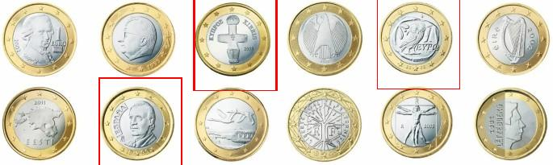

# Single Kernel Template Matching

## Overview

This project explores the feasibility of performing template matching using a single trainable kernel. The goal is to determine whether a neural network can successfully identify a template in a larger image using a single convolutional filter, enhanced by training on positive and negative examples. The concept follows the same idea as edge detection: a kernel should have the highest value around the area it is meant to detect. If the object doesn't change size or rotate, a single kernel can effectively locate the object within the image.


## Project Structure

- **dataset/**: Contains a sample for a template and a lookup image.
- **train.py/**: For training the kernel.
- **detect.py/**: For testing the trained kernel to find objects.
- **requirements.txt**: Lists the dependencies required to run the project.

## Installation

1. Clone the repository:
   ```bash
   git clone https://github.com/yourusername/single-kernel-template-matching.git
   cd single-kernel-template-matching
   ```

2. Install the required packages:
   ```bash
   pip install -r requirements.txt
   ```

## Training

During the training phase, only the template image needs to be passed the model learns to recognize a given template through the following auto generated dataset:

- **Positive Examples**: The kernel is trained on images of the template with added Gaussian noise. This helps the model learn to identify the template under slightly varying conditions.
- **Negative Examples**: The model is also exposed to negative examples where the image is shifted or contains only partial views of the template, allowing it to understand what does not constitute a match.


## Inference

During inference, the trained kernel is convolved over the entire lookup image. The following steps are performed:

1. **Convolution**: The kernel is applied to the lookup image to generate a convolution output.
2. **Sigmoid Activation**: The convolution values are passed through a sigmoid function, which normalizes the output to a range between 0 and 1.
3. **Thresholding**: Values above a specified threshold are considered matches. This threshold can be adjusted to refine the sensitivity of the template matching.


## Results
The model did surprisingly well at detection the given template and generalizing to similar object although it was never 
exposed to them during the training process

The used template


at a threshold of **0.9** the object was detected perfectly


at a threshold of **0.7** and **0.6** the object was detected along with other similar looking objects




## Future Work

I believe this concept can be enhanced by adding 
- Non Max Supression to get a single box per detected object
- Rotation transformation during training so templates can be matched in different orientations 


## License

This project is licensed under the MIT License - see the [LICENSE](LICENSE) file for details.

